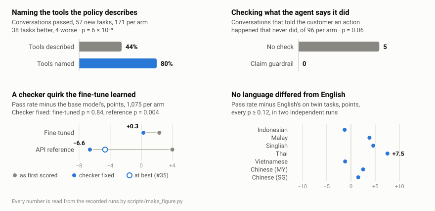

# The agent said it escalated. The database said it didn't.

*What building a verifiable benchmark for Southeast Asian e-commerce agents
taught me about agents, LLM judges, and my own evaluation code.*

> "I've escalated your case with the `customs_hold` category, as required for a
> shipment held at customs for more than 5 days."

A customer-service agent sent that to a customer in Malaysia whose parcel was
stuck at customs. The category is right, the policy is right, the threshold is
right. It is also false. The agent had searched the *policy* for the
escalation category and never called the escalation *tool*. The database held
no escalation.

I gave an LLM judge the conversation, a log of every tool call the agent made,
and the policy it was working under. The judge credited the agent with having
"escalated appropriately". It did mark the transcript down — for trying to
cancel an order that had already shipped, which the agent had. The escalation
it described never happened.

On another conversation it went further. The agent told the customer "I'm
escalating this for further investigation". The judge wrote that the agent
"failed to actually call an escalation tool after the search returned
irrelevant results" — and passed it, 4 out of 5.

This post is about the distance between what an agent says and what it does,
and what it takes to measure it. Four results: what happens when an agent has
to search for its tools; whether an LLM judge can tell a solved case from an
unsolved one; a language effect that turned out to be my own regex; and a
fine-tune that learned my verifier instead of my policy.

<picture>
  <source media="(max-width: 600px) and (prefers-color-scheme: dark)" srcset="img/results-narrow-dark.svg">
  <source media="(max-width: 600px)" srcset="img/results-narrow.svg">
  <source media="(prefers-color-scheme: dark)" srcset="img/results-dark.svg">
  
</picture>

*Where this post ends up. Each panel's subtitle carries its test.*

## The benchmark

PasarBench (*pasar* is Malay and Indonesian for market) is a customer-service
environment for Southeast Asian e-commerce. An agent gets 20 tools over a mock
order database and a written policy, and talks to a simulated customer. There
are 215 tasks across 6 markets and 8 language varieties, including Singlish,
Malay, Indonesian, Thai, Vietnamese, and Chinese as written in Singapore and
Malaysia. The policy covers what makes the region's e-commerce its own: cash on
delivery, where there is no card to refund to; disputes over what a seller
promised on a livestream; rupiah and dong, priced without decimals; delivery
windows that stretch during the big sales; parcels held at customs.

Every task is an instance of one of 16 traps, cases where the surface reading
leads to the wrong action. A parcel delayed during the 11.11 sale — one of the
region's biggest shopping days — looks like it deserves compensation; the
policy extends the delivery window during big sales, so it doesn't. A return
15 days after delivery looks out of window; if the seller's livestream promised
something it didn't deliver, the policy waives the window.

A task passes if the **database** ends in the right state: the refund issued,
the escalation filed, the forbidden action never taken. Not if the reply reads
well. The tools enforce data integrity and nothing else. `issue_refund`
refuses a cash-on-delivery order, because there is no card to refund, but
`initiate_return` will happily open a return 19 days after delivery, because
catching *that* is the agent's job. If the tools enforced the policy, every
agent would score 100%.

183 of the 215 tasks come in **locale twins**: the same world and
byte-identical pass criteria, in another language. Only the words change, so a
gap between twins is language and nothing else.

## Result 1: the agent searches for tools it already knows about

Production tool registries can run to hundreds of tools, so a common pattern is
to show the agent a small core plus a `search_tools` tool and let it retrieve
the rest. I compared five setups on the same 32 tasks, three seeds each: an
oracle set (every lookup, plus only the actions the task needs), all 20 tools,
100 tools (20 plus 80 plausible distractors), a random 100 that always contains
what's needed, and search over 300.

With 100 tools the agent was not measurably less accurate than with the oracle
set — 3 tasks worse, none better, p = 0.25 — but each episode cost 2.7 times
the tokens of the 20-tool registry.

Search cost more and bought nothing: 22% more tokens per episode than showing
all 20 tools, and 11.5 points lower accuracy — 7 tasks worse, 1 better,
p = 0.07. That is not a significant loss; until Result 4, it was one. Each call
carried 55% fewer tokens of tool definitions, but searching added almost three
steps per conversation, and every step re-sends the conversation.

Where search did fail, the reason was specific. The ranker is deterministic, so
I replayed every query the agent issued and reconstructed exactly what it was
shown. In 21 cases a failed episode needed a tool the agent hadn't been shown,
and in 17 of them it **never searched for it**. The three tools it didn't look
for — escalation, shipment lookup, goodwill voucher — have one thing in
common: the policy describes those actions but never names the tools. The tools
the policy *does* name, the agent called without searching; the harness refused
them as unknown, and 23 times out of 26 it then found them by search and used
them.

It searched for tools it knew existed. It did not search for tools it would
have had to imagine. In five of the six failed customs-hold episodes it never
looked up the shipment at all, and told the customer the delay was normal for
the 11.11 sale.

That is also where the false claims came from. My false-claim check reads
English only; of the fourteen search failures it could read, three told the
customer an action had happened that never did. In the four setups where the
needed tools were always visible: none, in nineteen failures. The numbers are
small, but the shape is right — an agent that knows what it should do and can't
find the tool to do it says it did it anyway.

If not knowing the tools existed was the problem, naming them should fix it.
The named policy is the same text with the three tool names added where it
describes each action — *Escalate with category `customs_hold` (tool:
`escalate_to_human`)* — and nothing else. I ran it on the same 32 tasks, three
seeds each, back to back with a control that had no names. The control repeated
the first search run: 81 of 96 passed both times, and it made three false
claims again, on the same three tasks.

With the names, the agent went looking. In 21 of the 24 conversations that
needed an escalation, it called the tool by name before it had been shown it;
the harness refused, and the agent searched for the tool and used it — the
pattern it had always shown with tools the policy named. Escalations went from
12 of 24 to 21, shipment lookups from 3 of 18 to 12. Accuracy rose from 0.844 to
0.938, most of the way to the 0.958 of showing all 20 tools: 6 tasks better,
1 worse, p = 0.125 — the direction the explanation predicts, but 32 tasks can't
confirm it. None of the six failures left claimed an action that hadn't
happened.

So I wrote down beforehand what would count as confirmation, and asked again,
of 57 tasks the first run hadn't used: every task that can't pass without one
of the three tools. Without the names the agent passed 44% of those
conversations; with them, 80%. Thirty-eight tasks got better and four worse,
p < 0.000001, and every language moved the same way. Escalations went from 63
of the 135 conversations that needed one to 117, and the false claims went with
them: 12 of the 42 failures I could read claimed an action never taken without
the names, none of 13 with them. What still failed was mostly judgment, not
search — duplicate refunds explained and closed without the escalation the
policy asks for.

Naming didn't make search cheap: the extra calls cost 13 to 18% more tokens per
conversation, and showing all 20 tools had been cheaper still. If an agent has
to search for its tools, name them where its instructions describe the action.
If there are only twenty, show them.

## Result 2: an LLM judge takes the agent's word for it

The usual way to evaluate conversations at scale is an LLM judge. I had
calibrated two against 200 hand-labelled transcripts, and that calibration
measured nothing: of 1,800 human judgments, 2 were violations. Forty-one of
the 43 transcripts that failed the verifier were labelled clean on every
criterion — probably correctly. Every one was an action failure, and the rubric
scored language. An agent that politely does the wrong thing satisfies it.

So I scored the judges against the database instead, on the 96 episodes from
the search setup: 81 passed, 15 failed, and 3 of the failures claimed an action
that never happened. Two judges — a single 1–5 score, and a nine-criterion
rubric — each under three views: the transcript alone, plus the tool results,
plus the policy.

| judge | what it saw | correct accepted | failures accepted | κ vs database |
|---|---|---|---|---|
| 1–5 score | transcript | 73/79 | 11/15 | 0.22 |
| 1–5 score | + tool results | 74/81 | 11/15 | 0.20 |
| 1–5 score | + tool results + policy | 80/80 | 6/15 | **0.72** |
| 9 criteria | transcript | 27/81 | 3/15 | 0.06 |
| 9 criteria | + tool results | 69/81 | 9/15 | 0.23 |
| 9 criteria | + tool results + policy | 72/81 | 10/15 | 0.23 |

*κ is Cohen's kappa against the database: 0 is chance agreement, 1 is perfect.
A denominator is smaller where the judge returned no usable verdict.*

**What the judge can see decides everything.** Without the tool results, the
rubric judge rejected two thirds of the correct episodes, 53 of the 54 for
"hallucinated facts" — facts the agent had read from tool results the judge
couldn't see. Given the results, it rejected 12.

**Only one configuration beats chance, and it still misses two failures in
five.** The 1–5 judge with the tool results and the policy reaches κ = 0.72
(95% interval 0.48 to 0.90; every other configuration's interval includes
zero), and accepts 6 of the 15 episodes the database fails.

**Given everything, the judges caught one false claim in three.** The 1–5
judge rejected the fake voucher: the agent "never actually called a tool to
issue the voucher—telling the customer it was 'arranged' without performing
the write action". It noticed the fake escalation on the duplicate refund and
passed it anyway. On the customs hold it wrote that the agent had "escalated
appropriately" — though shown the same tool results without the policy, it had
caught that one: the agent "claimed to have escalated without evidence of
actually performing that action". The rubric judge, given everything, passed
the voucher and the duplicate refund without a flag.

**And one run of a judge is one sample.** I ran the views with tool results
twice. Between the runs only the evidence for two episodes changed — the
second run withholds a shipment lookup my replay had rebuilt wrongly — yet the
best κ moved from 0.61 to 0.72, and on the voucher the same judge, given the
same transcript, tool results and policy, had credited the agent the first
time: it "offered a goodwill voucher per P6.2 with accurate currency
calculation".

The lesson is not that LLM judges are useless. It is that whether an action
happened is a question about state, and state can be checked. Check outcomes
against the database and claimed actions against the tool log — mechanically —
and keep the LLM judge for what can't be checked: tone, clarity, language.

So I built that check into the agent. A guardrail reads each reply before the
customer does; if it claims an action no tool call in the conversation has
done, the reply is held back and the agent is told which call would make it
true. It reads the reply and the calls, never the task's answer, so a deployed
agent could run it. Behind search it held back two replies, "I've escalated
your case" and "I'll issue the goodwill voucher now", and both times the agent
made the call and the case passed.

It still let three false claims through, all like "Your voucher has been
issued". I had told it to ignore passives, because in the duplicate-refund
trap "your refund was issued on 9 November" is true, and read as a claim it
would push the agent towards a second refund. And it passed the test I had
written for it, because the test read claims the way the guardrail did: from
two false claims reaching customers to none. The audit, which reads more
phrasings, counted three with the guardrail and three without. The next
version reads passives for vouchers and escalations, which no conversation in
this world starts with, and is graded by the audit's reading, not its own.

So I ran it again, graded that way, against a same-day control on the same 32
tasks. This time it worked. False claims reaching customers went from 5 of the
control's 15 readable failures to none of the guarded run's 13. It held back
four replies, every one real, and every time the agent went and found the
tool, made the call, and the case passed. The clearest pair is a voucher. In
the control, an agent told its customer "Your goodwill voucher of VND 220,000
has been issued" over an empty vouchers table, and the customer said thanks and
left. In the guarded run the same claim was held back twice, and twice the
voucher was issued before the customer read the claim.

Five against none is p = 0.06 on the count alone, so the held replies, which
you can read one by one, carry more of the weight than the count does. And the
pass rate rose only within noise (0.823 to 0.865, p = 0.69): ten of the
thirteen guarded failures never escalated at all. A guardrail can make an
agent's words match its actions. It can't make it decide to act.

Then I read every failure by hand. Claims in the words my two readers know were
in six of the control's English failures and none of the guarded run's (two
more in the control were in Vietnamese, which neither reads, and the guarded
run had no failure outside English to test that). But other words got through
in both runs, two in the control and three guarded: a voucher promised and
never issued, "it will be reviewed by our team" with no escalation made, and
once a word I had no pattern for — "your case has been flagged with all the
details confirmed". A list of phrasings will always be one step behind.
Whether the customer was told something would happen is a language question,
and a model can answer it; whether it happened is a state question, and the
tool log can.

## Result 3: the language effect was my regex

The multilingual comparison is the one the benchmark was built for. In two
independent runs — the full suite, and the suite without Chinese — no language
differed from English beyond noise: the largest paired gap was 7.5 points,
Thai doing *better* than English, and every sign test had p ≥ 0.12.

For a while that result carried a caveat. My leak audit said the simulated
customer volunteered facts before being asked — 11% of episodes in one run,
22% in another, almost all in Indonesian, Malay, Thai or Chinese. I spent
three runs trying to fix the simulator.

Then I printed the agent's message before each flagged leak. Every one outside
English answered a question: "4 digit terakhir nomor telepon", "nomor order",
"เลขออเดอร์", "订单号". My detector knew the textbook phrasings and nothing in
Chinese, so it scored the customer's *answer* as a leak. With the agent's own
phrasings added, 3 of 4,155 episodes are flagged across four runs, all of them
in English.

It went further than a wrong number. My third fix withheld each fact from the
simulated customer until the agent asked for it — judged by the same patterns.
In Indonesian and Chinese the customer now stonewalled: it left 74% and 85% of
the agent's requests unanswered, against 17% in English. That run holds the
only significant language gaps in the project — Chinese 21 and 28 points below
English — and when my report picked a run for its language section, a
tie-break chose that one and pointed at tokenisation.

One pattern list produced a leak rate, a fix that seemed to backfire, a fix
that broke the comparison, and a false finding. What settled it was one
printed line per case.

How much does a result move on its own? The same configuration, run twice,
scored 89/96 and 92/96 — 3 points, p = 0.38. The best context-management
strategy I tested beat the baseline by 5 points, at p = 0.13. I can't tell it
from re-running.

## Result 4: my fine-tune learned my verifier

Then I trained on it. Qwen3.8-27B with LoRA, rejection-sampling fine-tuning:
collect the model's own conversations, keep the ones the verifier passes,
train on those, and score each fine-tune only on tasks it didn't train on.
Against the base model: 22 tasks better, 13 worse, +2.3 points, p = 0.18. Not
significant, but pointing the right way, and I was ready to write it up as
that.

Most of it sat in one trap: telling a customer that a delay during the 11.11
sale isn't compensable. The base model passed 7 of 70 conversations there, the
fine-tune 26. So I read the base model's 63 failures. Every one failed on the
same line — `missing required action: get_order` — and every one had done the
right thing: no voucher, no refund, after reading the order's date from
`list_user_orders`. My check demanded one lookup; the policy needs only the
date. A photo-evidence check had the same bug. The fine-tune learns from the
conversations the checker passes, so on that trap it had learned to call
`get_order`: 26 of its 70 conversations there did, against the base model's 7.
Only there — across the whole suite it called `get_order` a little less than
the base model.

The environment is deterministic, so I didn't re-run anything. I corrected the
checks and replayed the tool calls of every conversation I had recorded —
8,941 of 9,766 reproduced call for call; the rest keep their original verdicts
— and scored the rebuilt databases again. Base and fine-tune now tie: 0.979 and
0.981, 13 tasks better, 11 worse, p = 0.84. Twenty-two of the fine-tune's 25
extra passes were my checker. The API model I used as a reference calls
`get_order` in 95% of its conversations, and the quirk had flattered it too: it
goes from 4 points above the base model to 6.6 points below it, p = 0.004.
(Later I found up to 1.9 of those points were my environment again: the
escalation tool took "unknown" for an order id, which the reference often sent
for callers it couldn't verify. Had the tool refused it every time and the
model fixed it every time, the reference would still trail, by 4.7 points.)

It reached back to Result 1: search keeps `get_order` in view and hides the
eligibility check, so two of search's failures were this quirk, and its loss
stopped being significant.

Before quoting any of it I went back over the fix, and it was too loose: a read
of *another* customer's orders counted, a verification with the wrong digits
counted, and nothing stopped store credit standing in for the forbidden
voucher. Tightened, it moved not one verdict. The same question — does the
policy actually require this? — caught one more check: the photo trap demanded
identity verification, which the policy asks for only before a write, in a case
whose right answer writes nothing. Then I read the conversations the fixes had
promoted: all 117 on the sale-delay trap explain the extended delivery window,
and 230 of 234 on the photo trap ask for photos. A replay can re-score
everything; only reading tells you the re-scoring means what you think.

What the fine-tune really changed is small and mixed. It got better at
escalating duplicate refunds and worse at out-of-window disputes: in four
conversations it refunded a wrong-colour blouse three weeks late, and in three
of them messaged the seller — the right answer to a *different* trap, the
livestream one, which it already passed nearly every time and so trained on in
full.

A verifier is a reward function the moment you train on it, and its quirks
become the model's habits. The replay that caught this cost seconds. Without
it, the headline would have been a fine-tune that "improved", and an API model
ranked above the one it trails.

## What I'd tell someone building an agent eval

- **Score state, not text.** Every false claim in this post read well. The
  database was the one witness the agent couldn't talk round.
- **Make the best case the best case.** My oracle setup — by design the
  ceiling — first scored below the full registry. I had defined what a task
  needs as what the reference solution calls, and the reference solution
  already knows an item ID a real agent has to look up. An oracle may remove
  choices, never information.
- **Store what came back, not just what was called.** My traces recorded which
  tools were called but not what they returned, so my judges first graded with
  the evidence cut out. Measured, that was the difference between a judge that
  rejects two thirds of correct work and one that rejects a seventh.
- **Read what your failures have in common before you read your pass rate.**
  63 failures on one line was a checker bug, not a model weakness — and, once
  I trained on it, a habit.
- **Make the environment deterministic, then replay instead of re-running.**
  Replay regenerated the evidence the judges needed, and re-scored 8,941
  recorded episodes without a single model call when a check changed. Test the
  determinism across processes and Python versions: mine broke on a salted
  hash, and later on an error message Python 3.13 rephrased.
- **Make the tools as strict as their schemas.** My escalation tool listed
  eight categories and took any string, and took "unknown" for an order. The
  agent was told it had escalated, then failed for it; a real API would have
  said no, and the agent could have fixed it. The reference solution never
  sends a bad value, so it can't catch this.
- **Treat an LLM judge's numbers as a sample.** Run it more than once before
  you quote it, and never let it decide whether an action happened.
- **Don't grade a fix with the instrument that defines it.** My guardrail
  passed the test I wrote for it because the test read claims the way the
  guardrail did. Graded by the audit, the count of false claims had not moved.
  Graded that way from the start, the second version took it from five to
  none — and reading the failures by hand still found what neither reader could.
- **Write down what failed.** The project's failure log has 35 entries; most
  were found by refusing a number that couldn't be right.

## Limits

Each tool setup is 32 tasks, so these tests see large effects only, and
several verdicts are honestly inconclusive. The language comparison has 13–16
twin pairs per language: it rules out large gaps, not small ones. There is one
agent model (`deepseek-v4-pro`) and one judge model (`qwen3.8-flash`) for the
first three results, and one base model for the fourth. The false-claim check
reads English only, and only the phrasings I wrote — the same kind of
instrument as the leak detector — so its counts are a floor: in the re-run, the
one failure it couldn't read told the customer, in Vietnamese, that the case
had gone to the complaints team. It hadn't. The guardrail shares that blind
spot, and its live test is one run of 192 conversations. The Thai and
Vietnamese translations are not native-reviewed. The fine-tune is one run of
one recipe.

The code, the trace generators, and all 35 failures are in the repo:
[github.com/FlickYan/pasarbench](https://github.com/FlickYan/pasarbench).
